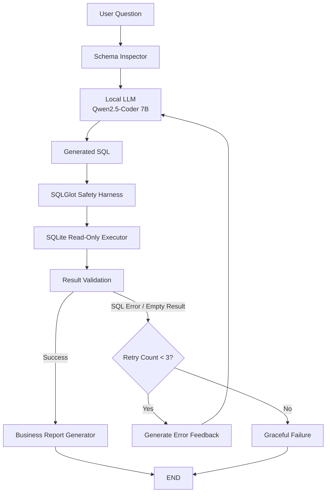

# Self-Correcting Text-to-SQL AI Agent

[](https://github.com/ghiniminsu/text-to-sql-agent/actions/workflows/ci.yml)

자연어 비즈니스 질문을 SQL로 변환하고, 실행 오류 또는 빈 결과 발생 시 오류 피드백을 이용해 SQL을 자동 수정하는 **LangGraph 기반 Self-Correcting Text-to-SQL Agent**입니다.

로컬 LLM과 Read-Only Database, SQL AST Safety Harness, Benchmark Eval Harness, Docker, GitHub Actions CI/CD를 결합하여 엔터프라이즈 환경에서의 안정성·재현성·평가 가능성을 고려했습니다.

---

## 1. Project Overview

### 목표

사용자가 다음과 같은 자연어 질문을 입력하면:

```text
매출 총액이 가장 높은 고객 5명을 알려줘.
```

Agent가 자동으로:

```text
Natural Language Question
        ↓
Database Schema Analysis
        ↓
Local LLM
        ↓
SQL Generation
        ↓
Safety Validation
        ↓
SQL Execution
        ↓
Result Validation
        ↓
Self-Correction
        ↓
Business Report
```

과정을 수행합니다.

### 주요 기술

- Python 3.11
- LangGraph
- LangChain Ollama
- Ollama
- Qwen2.5-Coder 7B
- SQLite / Chinook Database
- SQLGlot
- Pytest
- Ruff
- Docker / Docker Compose
- GitHub Actions
- GitHub Container Registry

---

## 2. Key Features

### 2.1 Text-to-SQL

Chinook SQLite DB의 실제 Schema를 동적으로 추출하여 Local LLM에게 전달합니다.

LLM은 존재하는 테이블과 컬럼 정보를 기반으로 SQLite SQL을 생성합니다.

```text
User Question
      +
Schema Context
      ↓
qwen2.5-coder:7b
      ↓
Generated SQL
```

---

### 2.2 Self-Correction Loop

SQL 실행 중 오류가 발생하거나 결과가 비어 있을 경우 해당 정보를 다시 LLM에게 전달합니다.

```text
SQL Generation
      ↓
Execution
      ↓
Validation
   ┌──┴─────────────┐
   │                │
Success        Error / Empty
   │                │
   │                ▼
   │          Error Feedback
   │                │
   │                ▼
   │          Retry Count + 1
   │                │
   │                ▼
   │          SQL Regeneration
   │                │
   └────────────────┘
```

Self-Correction은 최대 3회로 제한하여 무한 반복을 방지합니다.

```text
Initial Attempt
    ↓ failure
Retry #1
    ↓ failure
Retry #2
    ↓ failure
Retry #3
    ↓ failure
Graceful Failure
```

---

## 3. Architecture



---

## 4. LangGraph State Machine

Agent의 전체 실행 상태는 하나의 `AgentState`로 관리합니다.

주요 State:

```text
question
schema_context
generated_sql

query_columns
query_rows
row_count

business_report

error_message
validation_status

retry_count
max_retries
```

LangGraph StateGraph는 다음 흐름으로 구성됩니다.

```text
START
  ↓
prepare_schema
  ↓
generate_sql
  ↓
execute_sql
  ↓
validate_result
  │
  ├── success
  │      ↓
  │ generate_report
  │      ↓
  │     END
  │
  ├── error / empty
  │      ↓
  │ prepare_retry
  │      ↓
  │ generate_sql
  │
  └── retry exhausted
         ↓
   finalize_failure
         ↓
        END
```

---

## 5. Safety Harness

LLM이 생성한 SQL을 그대로 실행하지 않습니다.

여러 계층의 방어 구조를 적용했습니다.

```text
LLM Generated SQL
        ↓
SQLGlot AST Validation
        ↓
SQLite mode=ro
        ↓
PRAGMA query_only
        ↓
Docker Read-Only Volume
        ↓
Chinook Database
```

### SQL AST Allow-list

허용:

```sql
SELECT ...
WITH ...
UNION ...
INTERSECT ...
EXCEPT ...
```

차단 대상 예시:

```sql
DELETE
UPDATE
INSERT
DROP
CREATE
ALTER
PRAGMA
ATTACH
VACUUM
```

또한 다음과 같은 Multi-Statement SQL도 차단합니다.

```sql
SELECT * FROM Artist;
DELETE FROM Artist;
```

단순 문자열 필터가 아니라 SQLGlot AST를 이용해 SQL 구조를 검사합니다.

---

## 6. Database Safety

SQLite 연결 자체도 Read-Only 모드로 구성했습니다.

```text
mode=ro
+
PRAGMA query_only = ON
```

따라서 Safety Harness를 우회하는 쓰기 SQL이 발생하더라도 DB 계층에서 한 번 더 차단합니다.

Docker 실행 시에도:

```yaml
./data:/app/data:ro
```

형태로 DB 볼륨을 Read-Only로 마운트합니다.

---

## 7. Schema Inspector

SQLite metadata를 이용해 다음 정보를 자동으로 추출합니다.

```text
Tables
Columns
Data Types
Primary Keys
Foreign Keys
```

예:

```text
Table: Album

Columns:
- AlbumId INTEGER PRIMARY KEY
- Title NVARCHAR
- ArtistId INTEGER

Foreign Keys:
- ArtistId -> Artist.ArtistId
```

이 Schema Context를 LLM에 전달하여 존재하지 않는 테이블/컬럼을 추측하는 문제를 줄였습니다.

---

## 8. Business Report Generation

SQL 실행에 성공하면 실제 QueryResult를 이용해 사용자용 비즈니스 리포트를 생성합니다.

```text
Executed SQL
      +
QueryResult
      +
Original Question
      ↓
Local LLM
      ↓
Business Report
```

Report LLM에는 실제 DB 실행 결과만 전달하며, 결과에 없는 숫자나 사실을 생성하지 않도록 프롬프트를 구성했습니다.

---

## 9. Evaluation Harness

Agent 성능을 수치로 측정하기 위한 자체 Eval Harness를 구축했습니다.

평가 지표:

### First-pass Success Rate

Self-Correction 없이 최초 SQL 실행에서 성공한 비율.

### Final Success Rate

Self-Correction을 포함한 최종 SQL 실행 성공률.

### Answer Accuracy

LLM SQL의 실행 결과와 Gold SQL 실행 결과가 일치한 비율.

SQL 문자열 자체가 동일한지가 아니라 **실행 결과 기준으로 평가**합니다.

### Self-Correction Recovery Rate

최초 실행에 실패한 케이스 중 Self-Correction으로 복구된 비율.

### Average Retry Count

질문당 평균 SQL 재생성 횟수.

### Average Latency

질문 하나를 처리하는 데 걸린 평균 실행 시간.

### Safety Block Rate

위험 SQL benchmark 중 Safety Harness가 정상 차단한 비율.

---

## 10. Benchmark

Chinook Database 기반 Gold Benchmark를 구성했습니다.

현재 benchmark는 다음 유형의 질문을 포함합니다.

```text
Aggregation
JOIN
Multi-table JOIN
GROUP BY
ORDER BY
DISTINCT
Date Aggregation
Anti Join
Revenue Analysis
Customer Analysis
Artist Analysis
Genre Analysis
```

난이도:

```text
Easy
Medium
Hard
```

Gold Answer는 사람이 직접 숫자를 입력하지 않고 다음 방식으로 생성합니다.

```text
Gold SQL
    ↓
Safety Harness
    ↓
Chinook Database
    ↓
Expected Rows
```

Gold 데이터 생성:

```bash
python -m evals.generate_gold
```

Agent 평가:

```bash
python -m evals.run_eval
```

평가 결과 확인:

```bash
python -m evals.show_results
```

---

## 11. Benchmark Results

> 아래 수치는 `python -m evals.show_results`의 실제 결과로 업데이트합니다.

| Metric | Result |
|---|---:|
| Benchmark Questions | 20 |
| First-pass Success Rate | `<FIRST_PASS_SUCCESS>` |
| Final Success Rate | `<FINAL_SUCCESS>` |
| Answer Accuracy | `<ANSWER_ACCURACY>` |
| Self-Correction Recovery Rate | `<RECOVERY_RATE>` |
| Average Retry Count | `<AVERAGE_RETRY>` |
| Average Latency | `<AVERAGE_LATENCY>` |
| Safety Block Rate | `<SAFETY_BLOCK_RATE>` |
| Safety Policy Accuracy | `<SAFETY_POLICY_ACCURACY>` |

---

## 12. Project Structure

```text
text-to-sql-agent/
├── .github/
│   └── workflows/
│       ├── ci.yml
│       └── publish.yml
│
├── data/
│   └── chinook.db
│
├── evals/
│   ├── __init__.py
│   ├── benchmark.json
│   ├── generate_gold.py
│   ├── run_eval.py
│   └── show_results.py
│
├── src/
│   ├── agent/
│   │   ├── state.py
│   │   ├── prompts.py
│   │   ├── llm.py
│   │   ├── nodes.py
│   │   ├── router.py
│   │   └── graph.py
│   │
│   └── harness/
│       ├── database.py
│       ├── safety.py
│       ├── schema.py
│       └── evaluator.py
│
├── tests/
│   ├── test_database.py
│   ├── test_safety.py
│   ├── test_schema.py
│   ├── test_llm.py
│   ├── test_nodes.py
│   ├── test_router.py
│   ├── test_graph.py
│   └── test_evaluator.py
│
├── Dockerfile
├── docker-compose.yml
├── .dockerignore
├── pytest.ini
├── requirements.txt
└── requirements-dev.txt
```

---

## 13. Local Development

### Requirements

- macOS / Linux
- Python 3.11
- Ollama
- Docker
- Qwen2.5-Coder 7B

### Virtual Environment

```bash
python3.11 -m venv .venv

source .venv/bin/activate

python -m pip install -r requirements-dev.txt
```

### Ollama

모델 설치:

```bash
ollama pull qwen2.5-coder:7b
```

확인:

```bash
ollama list
```

환경 변수:

```bash
export OLLAMA_MODEL=qwen2.5-coder:7b
export OLLAMA_BASE_URL=http://127.0.0.1:11434
```

---

## 14. Run Tests

전체 테스트:

```bash
python -m pytest -c pytest.ini -v
```

Lint:

```bash
ruff check src tests evals
```

---

## 15. Run Evaluation

Gold Benchmark 생성:

```bash
python -m evals.generate_gold
```

평가:

```bash
python -m evals.run_eval
```

결과 요약:

```bash
python -m evals.show_results
```

---

## 16. Docker

Docker 이미지 Build:

```bash
docker compose build
```

테스트:

```bash
docker compose run --rm agent \
python -m pytest -c pytest.ini -v
```

Agent Eval 실행:

```bash
docker compose run --rm agent
```

Docker 내부에서는 Mac 호스트 Ollama에 다음 주소로 접근합니다.

```text
http://host.docker.internal:11434
```

---

## 17. CI/CD

### Continuous Integration

GitHub Actions에서 자동으로 다음 검증을 실행합니다.

```text
Git Push / Pull Request
        ↓
Python 3.11
        ↓
Ruff
        ↓
Pytest
        ↓
Docker Build
        ↓
Dockerized Tests
```

실제 LLM Runtime은 CI에서 실행하지 않습니다.

Agent StateGraph와 Self-Correction은 Fake LLM 기반 deterministic test로 검증하여 CI 결과가 LLM 출력이나 네트워크 환경에 영향을 받지 않도록 구성했습니다.

### Continuous Delivery

CI 성공 후 Docker 이미지를 GitHub Container Registry에 자동 배포합니다.

```text
CI PASS
   ↓
Docker Build
   ↓
GHCR Login
   ↓
Docker Push
   ↓
ghcr.io/ghiniminsu/text-to-sql-agent
```

이미지 다운로드:

```bash
docker pull \
ghcr.io/ghiniminsu/text-to-sql-agent:latest
```

---

## 18. Design Decisions

### Why LangGraph?

Self-Correction을 단순 Python `while` loop로 구현하지 않고 명시적인 StateGraph로 관리하기 위해 사용했습니다.

이를 통해:

- 상태 추적
- 조건부 routing
- 재시도 제어
- 종료 조건
- 오류 피드백

을 그래프 수준에서 표현할 수 있습니다.

### Why Local LLM?

기업 내부 DB 분석에서는 데이터 외부 전송이 제한되는 환경을 고려할 필요가 있습니다.

Ollama 기반 Local LLM을 사용하여 외부 API 없이 Text-to-SQL을 실행할 수 있도록 설계했습니다.

### Why Result-based Evaluation?

Text-to-SQL 문제에서는 서로 다른 SQL이 동일한 정답을 만들 수 있습니다.

따라서 SQL 문자열 일치 여부 대신:

```text
Generated SQL
      ↓
Execution
      ↓
Actual Rows

vs

Gold SQL
      ↓
Execution
      ↓
Expected Rows
```

방식으로 평가했습니다.

### Why Bounded Retry?

LLM Agent의 무한 재시도 위험을 방지하기 위해 Self-Correction 횟수를 최대 3회로 제한했습니다.

---

## 19. Testing Strategy

실제 LLM 테스트와 deterministic CI를 분리했습니다.

### CI Tests

```text
Fake LLM
Temporary SQLite
Deterministic StateGraph
```

### Local Benchmark

```text
Real Ollama
Qwen2.5-Coder 7B
Chinook Database
```

이를 통해 CI 재현성을 유지하면서 실제 모델 성능도 별도로 측정할 수 있습니다.

---

## 20. Limitations

현재 프로젝트에는 다음 한계가 있습니다.

- 단일 SQLite DB 기준
- Schema 전체를 Prompt에 포함
- 복잡한 대규모 DB에 대한 Schema Retrieval 미적용
- SQL 의미적 정확도는 Gold Result 비교 기반
- Local LLM 성능이 머신 사양에 영향을 받음
- Business Report 품질에 대한 별도 정량 평가 미구현

---

## 21. Future Improvements

향후 다음 기능으로 확장할 수 있습니다.

```text
Schema Retrieval / RAG
        ↓
Relevant Table Selection
        ↓
Large Enterprise DB Support
```

추가 개선 후보:

- PostgreSQL 지원
- Query timeout / resource limits
- SQL cost estimation
- Human-in-the-loop approval
- LangGraph checkpointing
- Model comparison benchmark
- Observability / tracing
- FastAPI REST API
- Web UI
- Result visualization
- Query caching

---

## 22. Engineering Focus

이 프로젝트는 단순 LLM API 호출보다 다음 세 가지 엔지니어링 문제에 초점을 맞췄습니다.

### Loop Engineering

```text
Generate
→ Execute
→ Validate
→ Feedback
→ Correct
→ Bounded Retry
```

### Harness Engineering

```text
AST Safety
→ Read-Only DB
→ Query-only SQLite
→ Read-Only Container Volume
```

### Evaluation Engineering

```text
Gold Benchmark
→ Execution Result Comparison
→ Recovery Measurement
→ Safety Evaluation
```

---

## 23. Container Image

```text
ghcr.io/ghiniminsu/text-to-sql-agent:latest
```

Pull:

```bash
docker pull \
ghcr.io/ghiniminsu/text-to-sql-agent:latest
```

---

## 24. Summary

이 프로젝트는 다음 전체 흐름을 하나의 재현 가능한 AI 시스템으로 구성합니다.

```text
Natural Language
        ↓
Schema-aware Local LLM
        ↓
Text-to-SQL
        ↓
Safety Harness
        ↓
Read-Only Execution
        ↓
Result Validation
        ↓
Self-Correction
        ↓
Business Report
        ↓
Eval Harness
        ↓
Docker
        ↓
CI/CD
```

핵심 목표는 **SQL을 생성하는 LLM 자체가 아니라, 실패 가능한 LLM을 안전하고 평가 가능한 시스템 안에서 운영하는 Agent Architecture를 구현하는 것**입니다.